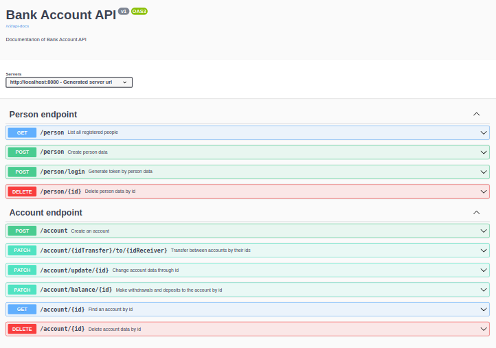

[](https://github.com/Humberto-Bonadiman/bank-account/actions/workflows/docker-publish.yml)

# Boas vindas ao repositório do projeto Bank Account

---

## Descrição do projeto

Neste projeto eu fui responsável por criar uma API REST responsável por gerenciar contas bancárias utilizando Java com Spring-boot e o banco de dados MySQL.
</br>
Inicialmente para abrir uma conta é necessário apenas o nome completo e o CPF da pessoa. Após é gerado um token que é utilizado na criação da conta, onde a pessoa irá terminar de informar os seus dados para o cadastro.
</br>
Com essa conta é possível realizar transferências para outras contas, depositar e realizar saques.

---

## Instalação do projeto localmente

Após cada um dos passos, haverá um exemplo do comando a ser digitado para fazer o que está sendo pedido.

1. Realize o clone do projeto no diretório de sua preferência:
```javascript
git clone git@github.com:humberto-bonadiman/bank-account.git
```

2. Acesse o diretório do projeto e depois utilize o comando **mvn install** para instalar todas as dependências necessárias:
```javascript
  cd bank-account
  mvn install
```

## Adicionando o SECRET

Para realizar a criação e a leitura do token você pode utilizar o seguinte comando:
```javascript
export SECRET=sua_chave_vai_aqui
```
Não é um comando obrigatório pois a aplicação já roda sem a SECRET, porém é sempre indicado criá-la.

## Comandos para utilizar o Docker

Caso o MySQL esteja ativo em sua máquina é necessário realizar o comando:
```javascript
sudo service mysql stop
```

Para criar e iniciar os contêineres:
</br>
Obs.: Com o comando abaixo o docker fica rodando no terminal.
```javascript
docker-compose up
```

Para criar e iniciar os contêineres em stand-by:
```javascript
docker-compose up -d
```

Para realizar apenas a etapa de build das imagens que serão utilizadas:
```javascript
docker-compose build
```

Para paralisar e remover todos os contêineres e seus componentes como rede, imagem e volume:
```javascript
docker-compose down
```
---

## Utilizando o Spring-boot sem o Docker

Primeiramente, ative o MySQL:
```javascript
sudo service mysql start
```
No arquivo que está no caminho **/src/main/resources/application.yml** você deve alterar os campos **spring.datasource.username** e **spring.datasource.password** conforme os dados de username e password do seu MySQL.
Após altere o arquivo application.properties que está localizado no seguinte caminho /src/main/resources/application.yml. Nele você deve alterar a 7ª(username) e a 8ª(password) linha com o usuário e senha do seu MySQL:
```javascript
spring:
  datasource:
    username: username
    password: password
```

Rodar o Spring-Boot com o comando:
```javascript
mvn spring-boot:run
```

---

## Realização dos testes

Para realizar todos os testes da aplicação você pode utilizar o seguinte comando:
```javascript
mvn clean test
```

Para realizar somente um teste específico você deve utilizar o comando:
```javascript
mvn test -Dtest=O_nome_do_teste_vai_aqui
```

Exemplo:
```javascript
mvn test -Dtest=AccountCreateApplicationTests
```

Para realizar mais de um teste basta adicionar uma vírgula ao final do teste conforme o exemplo:
```javascript
mvn test -Dtest=AccountCreateApplicationTests,AccountDeleteByIdApplicationTests
```

Para realizar os testes do pacote **account** você deve utilizar o seguinte comando:
```javascript
mvn test -Dtest="com.java.spring.account.**"
```

Para realizar os testes do pacote **person** você deve utilizar o seguinte comando:
```javascript
mvn test -Dtest="com.java.spring.person.**"
```

## Documentação



Para acessar a documentação pelo swagger rode o comando **mvn spring-boot:run** e acesse o projeto via browser, no caminho http://localhost:8080/swagger-ui/index.html ou pelo caminho http://localhost:8080/v3/api-docs.
